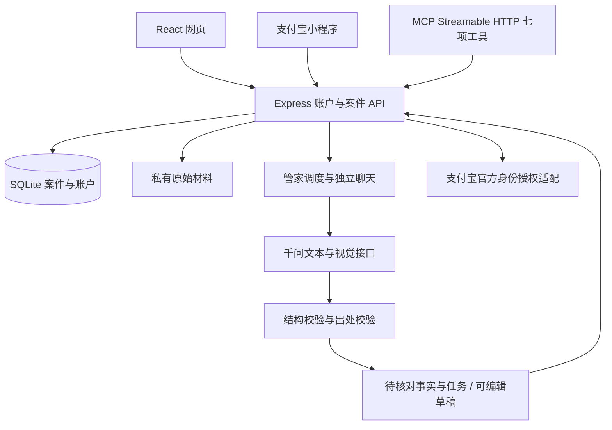

# WhyDuck 技术架构

正式产品由 React/TypeScript 页面、Express API 和 Node.js SQLite 持久层组成。`design/` 是已验收的设计原型；正式业务入口是根目录 `index.html` 与 `src/client/main.tsx`。

浏览器和支付宝小程序访问同一案件服务。账户会话用于网页，账户签发且可撤销的访问令牌用于小程序与 MCP。材料文件保存在私有数据目录，下载经过账户与案件归属检查，不进入公开静态资源目录。

管家首先理解诉求并选择必要成员，专业角色分别调用模型，接力结果回到管家汇总。指定角色的独立聊天和群聊 @ 请求只执行该角色。模型工具按角色授予权限；结果通过结构校验和证据引用校验后保存。失败、取消和重试保留运行记录，不生成假成功消息。

图片在服务端校验真实格式与像素上限，原始字节及 SHA-256 留作出处。视觉提取结果仍待人工核对；模型不能把提取结果升级为已确认事实。事实修改更新版本并使旧沟通草稿过期。建议待办需要用户确认，报告默认脱敏，发送消息、投诉与退款操作仍由用户完成。

SQLite 适合当前单实例交付：事务用于数据更新，持久卷保存数据库和私有文件。扩展为多实例前应迁移关系数据及对象存储，并将运行锁和队列改为共享服务。不能让多个容器各自持有独立 SQLite 后声称共享案件。

模型密钥与支付宝私钥只在服务器环境读取。真实外部调用是否可用取决于账户开通、模型额度、平台授权和生产配置；本地契约测试不会替代这些联调证据。
